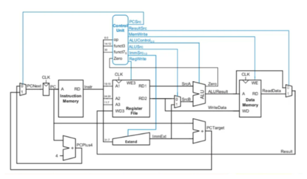
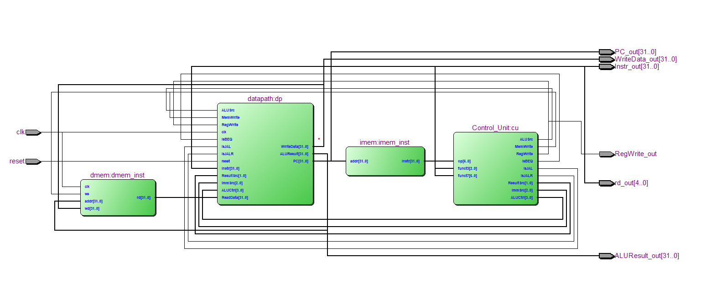
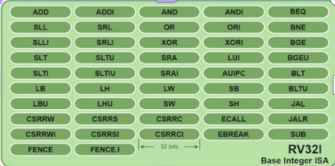
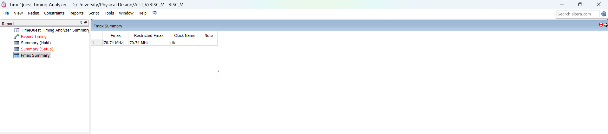
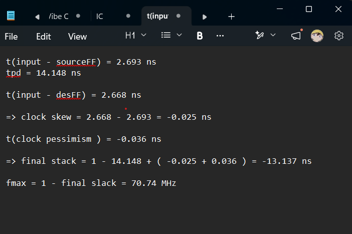
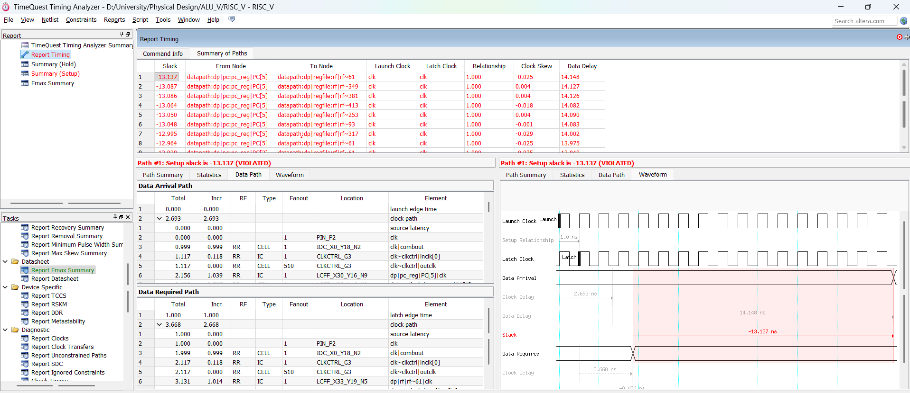
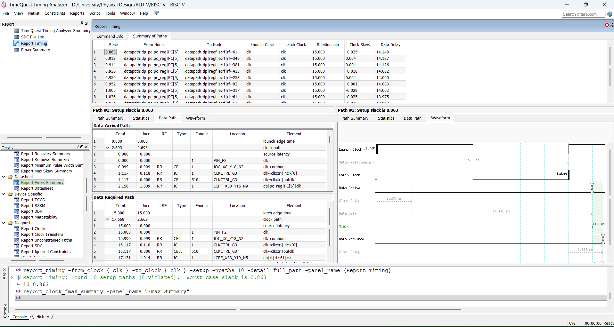
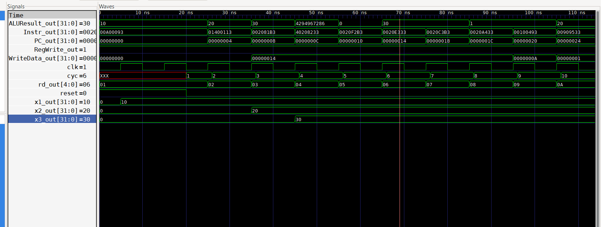

# RISC-V 32-bit Processor (RISV_V_32b)

A single-cycle **32-bit RISC-V** processor core implementing the base integer instruction set (**RV32I**).  
Designed, simulated and synthesized using **Intel Quartus Prime** + **TimeQuest Timing Analyzer**.

**Achieved Fmax: 70.74 MHz**

---

## Project Structure

```
ALU_V/
├── alu.v                 # Arithmetic Logic Unit
├── Control_Unit.v        # Main Control Unit
├── cpu_core.v            # Top-level CPU core
├── datapath.v            # Datapath module
├── dmem.v                # Data Memory
├── imem.v                # Instruction Memory
├── ImmGen.v              # Immediate Generator
├── pc.v                  # Program Counter
├── regfile.v             # Register File (32 × 32-bit)
├── tb_riscv.v            # Testbench
├── programR.mem          # Instruction memory initialization file
├── testr.s               # Assembly test program
├── RISC_V.qpf / .qsf     # Quartus project files
├── RISC_V.sdc            # Timing constraints (SDC)
├── run_simulation.bat    # Script to run simulation
├── run_convert.bat       # Script to convert memory / waveform
├── dump.vcd              # VCD waveform dump (for GTKWave)
├── images/               # Timing reports, RTL viewer, waveform, diagrams
└── README.md
```

---

## Architecture Overview

The processor is a classic **single-cycle** RISC-V core with the following main blocks:

| Module            | Description                                      |
|-------------------|--------------------------------------------------|
| **datapath**      | Register File, ALU, PC, multiplexers, ImmGen    |
| **Control_Unit**  | Generates control signals from opcode & funct   |
| **imem**          | Instruction Memory                              |
| **dmem**          | Data Memory                                     |

### Datapath Diagram



### RTL Viewer (from Quartus)



---

## Supported Instructions – RV32I Base Integer ISA

The design implements the **RV32I** base integer instruction set (32-bit):



### Instruction Groups

| Type     | Instructions                                                                 |
|----------|------------------------------------------------------------------------------|
| **R-type** | `ADD`, `SUB`, `SLL`, `SLT`, `SLTU`, `XOR`, `SRL`, `SRA`, `OR`, `AND`       |
| **I-type** | `ADDI`, `SLTI`, `SLTIU`, `XORI`, `ORI`, `ANDI`, `SLLI`, `SRLI`, `SRAI`    |
| **Load**   | `LB`, `LH`, `LW`, `LBU`, `LHU`                                              |
| **Store**  | `SB`, `SH`, `SW`                                                            |
| **Branch** | `BEQ`, `BNE`, `BLT`, `BGE`, `BLTU`, `BGEU`                                  |
| **Jump**   | `JAL`, `JALR`                                                               |
| **U-type** | `LUI`, `AUIPC`                                                              |
| **System** | `ECALL`, `EBREAK`, `CSRRW`, `CSRRS`, `CSRRC`, `CSRRWI`, `CSRRSI`, `CSRRCI` |
| **Fence**  | `FENCE`, `FENCE.I`                                                          |

---

## Timing Analysis Results

### Fmax Summary

| Fmax          | Restricted Fmax | Clock | Note |
|---------------|-----------------|-------|------|
| **70.74 MHz** | 70.74 MHz       | clk   | -    |



### Critical Path Calculation

From the worst-case path (PC register → Register File):

```
t(input → sourceFF)  =  2.693 ns
tpd                  = 14.148 ns
t(input → destFF)    =  2.668 ns
Clock skew           = -0.025 ns
Clock pessimism      = -0.036 ns

Final slack (period = 1 ns) = 1 - 14.148 + (-0.025 + 0.036) = -13.137 ns
→ Fmax ≈ 70.74 MHz
```



### Timing Reports

**Before correct period constraint (period = 1 ns) – Setup violations:**



**After applying proper period constraint (period = 15 ns) – All paths met:**



- Worst setup slack after constraint: **+0.863 ns**
- Critical path: `pc_reg[PC[5]]` → `regfile`

---

## Functional Simulation & Waveform

### Simulation Result



Key observations:
- `PC_out` increments by 4 each cycle
- Instructions are correctly fetched from `imem`
- `ALUResult_out` produces expected values
- Register write enable and write data work as designed

### How to View Waveform with GTKWave

1. **Run the simulation** to generate the VCD file:

   ```bash
   # Windows
   run_simulation.bat

   # or manually with ModelSim / QuestaSim / Icarus Verilog
   vlog *.v
   vsim -c tb_riscv -do "run -all; quit"
   ```

   After simulation finishes, the file `dump.vcd` will be created in the project folder.

2. **Open GTKWave**:

   ```bash
   gtkwave dump.vcd
   ```

3. In GTKWave:
   - Expand the top module (`tb_riscv` or `cpu_core`) in the left panel.
   - Select the signals you want to observe (`clk`, `PC_out`, `Instr_out`, `ALUResult_out`, `RegWrite_out`, `WriteData_out`, `rd_out`, register values…).
   - Click **Append** or drag them into the waveform window.
   - Use the zoom and cursor tools to analyze the timing.

> **Tip**: You can save a GTKWave save file (`.gtkw`) so next time you only need to open:
> ```bash
> gtkwave dump.vcd my_signals.gtkw
> ```

---

## How to Run the Project

### 1. Simulation

```bash
# Using the provided batch file (Windows)
run_simulation.bat

# Manual (ModelSim / QuestaSim)
vlog alu.v Control_Unit.v cpu_core.v datapath.v dmem.v imem.v ImmGen.v pc.v regfile.v tb_riscv.v
vsim -c tb_riscv -do "run -all; quit"
```

### 2. Synthesis & Timing Analysis (Quartus Prime)

1. Open the project file `RISC_V.qpf`.
2. Run **Analysis & Synthesis** → **Fitter** → **Assembler**.
3. Open **TimeQuest Timing Analyzer**.
4. Run the following Tcl commands:

```tcl
report_timing -from_clock {clk} -to_clock {clk} -setup -npaths 10 -detail full_path
report_clock_fmax_summary
```

---

## Key Results Summary

| Metric                    | Value                          |
|---------------------------|--------------------------------|
| ISA                       | **RV32I** (Base Integer)       |
| Architecture              | Single-cycle                   |
| Data path width           | 32-bit                         |
| Register File             | 32 × 32-bit                    |
| Maximum Frequency (Fmax)  | **70.74 MHz**                  |
| Worst Setup Slack         | +0.863 ns (with 15 ns period)  |
| Critical Path             | PC → Register File             |
| Toolchain                 | Quartus Prime + TimeQuest      |
| Waveform Viewer           | GTKWave (via `dump.vcd`)       |

---

## Author & Context

- **Project**: RISV_V_32b / ALU_V
- **Course**: Physical Design / Digital System Design
- **Toolchain**: Intel Quartus Prime, TimeQuest Timing Analyzer, GTKWave
- **Year**: 2025 – 2026

---
